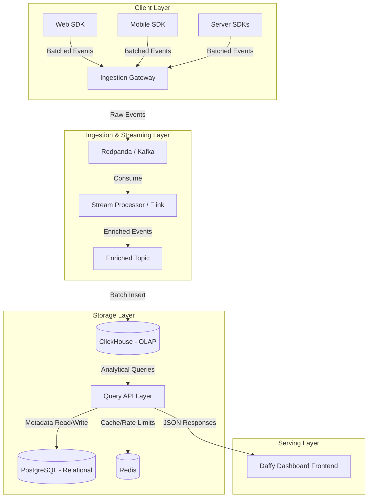

# Daffy Backend Architecture

This document outlines the production-ready backend architecture designed to support **Daffy**, a product analytics platform capable of handling **1,000,000 Events Per Second (10 Lakhs EPS)** with sub-second analytical query latencies.

## 1. High-Level Architecture Diagram



## 2. Core Components

### 2.1. Client SDKs (The Sources)
To prevent overwhelming the backend, clients must intelligently batch events.
- **Batching & Compression**: SDKs should batch events (e.g., every 5 seconds or 100 events) and compress payloads (Gzip or zstd) before sending them.
- **Resilience**: Implement exponential backoff and retry mechanisms for network failures.
- **Local Feature Flag Evaluation**: SDKs should periodically fetch flag rules and evaluate them locally to avoid network latency per flag check.

### 2.2. Ingestion Gateway (Go or Rust)
The frontline API designed purely to absorb massive write loads.
- **Responsibilities**: Lightweight API key validation, payload schema validation, appending server-side timestamps, and publishing to the message queue.
- **Technology Choice**: **Go** (Fiber/Gin) or **Rust** (Actix-web) for extremely high concurrency and low memory footprint. Node.js is generally not recommended for 1M EPS ingestion without massive horizontal scaling.
- **Scaling**: Stateless, highly scalable via Kubernetes Horizontal Pod Autoscaler (HPA) behind a robust Load Balancer (e.g., AWS ALB or HAProxy).

### 2.3. Message Queue / Buffer (Redpanda or Apache Kafka)
Acts as the shock absorber. It prevents the database from falling over during sudden traffic spikes.
- **Technology Choice**: **Redpanda** is highly recommended over JVM-based Kafka for its modern C++ architecture, zero data loss, and significantly lower operational overhead at 1M+ EPS.
- **Topics**: `raw-events`, `processed-events`, `dead-letter-queue` (for invalid schemas).

### 2.4. Stream Processing (Apache Flink or Vector)
Optional but recommended for data enrichment before it hits the database.
- **Responsibilities**: Sessionization (grouping events into user sessions), IP-to-Geo lookups, User-Agent parsing, and dropping duplicates/bot traffic.
- **Output**: Writes the clean, enriched data back to an `enriched-events` topic.

### 2.5. Storage Layer (The Brain)
Separating analytical storage from relational metadata is crucial.
- **OLAP Database**: **ClickHouse**
  - **Why ClickHouse?**: It is the undisputed champion for time-series and event analytics. It can easily ingest millions of rows per second in batches and query billions of rows in milliseconds using its columnar storage format.
  - **Ingestion**: Use ClickHouse Kafka Engine to pull directly from Redpanda/Kafka in massive micro-batches.
- **Relational Database**: **PostgreSQL**
  - Stores user accounts, dashboard configurations, feature flag rules, and project metadata.
- **Caching**: **Redis**
  - Caches dashboard query results for frequently accessed time ranges. Stores rate-limiting counters for the ingestion gateway.

### 2.6. Query & API Layer (Go or Node.js)
The backend that powers the Daffy Dashboard.
- **Responsibilities**: Translating dashboard requests into optimized ClickHouse SQL queries, enforcing permissions, and managing the application state (users, projects).
- **Caching Strategy**: Queries requesting "Last 30 Days" can be aggressively cached, only re-fetching the most recent delta.

---

## 3. Data Flow Workflows

### Scenario A: Ingesting an Event
1. User clicks a button -> Client SDK queues the event.
2. SDK flushes batch of 50 events -> `POST /v1/ingest`.
3. Ingestion Gateway validates the project API key via a fast Redis lookup.
4. Gateway pushes the payload to the Redpanda `raw-events` topic.
5. Gateway responds `202 Accepted` to the client (Latency: < 10ms).
6. ClickHouse asynchronously consumes from Redpanda and inserts into an `events` table.

### Scenario B: Dashboard Query (e.g., "Daily Active Users")
1. Dashboard requests DAU for the last 7 days.
2. Query API checks Redis for a cached result.
3. If miss, it sends an optimized SQL query to ClickHouse:
   ```sql
   SELECT toDate(timestamp) as day, uniqExact(user_id) as dau
   FROM events
   WHERE project_id = '...' AND timestamp >= now() - INTERVAL 7 DAY
   GROUP BY day
   ```
4. ClickHouse scans millions of rows in milliseconds.
5. API caches the result in Redis and returns it to the frontend.

---

## 4. Feature Flag Implementation at Scale

Feature flags require zero-latency evaluation. You cannot afford a database round-trip every time you need to check if a feature is enabled.

1. **Rule Distribution**: The Postgres DB stores the rules (e.g., "Enable for 20% of users in US").
2. **CDN / Edge Cache**: The API serializes these rules into a JSON file and pushes it to an Edge CDN (Cloudflare/AWS CloudFront).
3. **Client Polling**: The SDK fetches the JSON ruleset periodically (e.g., every 5 minutes).
4. **Local Evaluation**: When the app calls `daffy.isFeatureEnabled('new-checkout', user)`, the SDK runs the hashing algorithm locally (e.g., MurmurHash on the User ID) to deterministically resolve the flag without network calls.

---

## 5. Implementation Roadmap

### Phase 1: The Core Pipeline (MVP)
- Set up a basic Go Ingestion Gateway.
- Deploy a managed ClickHouse cluster (e.g., ClickHouse Cloud) and a small Kafka cluster.
- Connect Kafka to ClickHouse using the native Kafka Engine.
- Build the Node.js Query API to serve basic DAU/MAU charts.

### Phase 2: Metadata & Dashboards
- Introduce PostgreSQL for user authentication and dashboard configurations.
- Build out the full REST API to support the Next.js frontend (replacing the mocked `SimulationContext`).
- Implement Redis for caching complex analytical queries to reduce ClickHouse load.

### Phase 3: Scale to 1M EPS
- Swap Kafka for Redpanda for cost efficiency and performance.
- Introduce Apache Flink for real-time sessionization and data enrichment.
- Implement autoscaling for the Ingestion Gateway based on CPU/Memory metrics.
- Partition ClickHouse tables by date and configure tiered storage (hot data on NVMe, old data on S3).

## 6. Infrastructure Estimates for 1M EPS
To handle 1M EPS (~2.5 trillion events/month) without breaking a sweat, you are looking at substantial infrastructure:
- **Ingestion**: 20-30 Go/Rust Gateway instances.
- **Queue**: 3-5 high-throughput Redpanda broker nodes (NVMe disks).
- **OLAP**: ClickHouse cluster with 3-5 large nodes (e.g., 64 vCPU, 256GB RAM each) for fast query performance.
- **Bandwidth**: Expect massive inbound data transfer; utilize VPC peering where possible to minimize costs.
